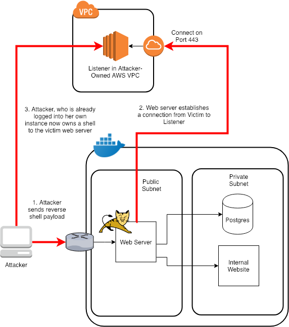

# RCE - Remote Code Execution & Obtaining a Reverse Shell

A remote code injection (RCE) vulnerability is the most deadly type of vulnerability since it gives an attacker command and control in some regard or another of a host server.

When you find an RCE, you can use it to execute commands as the user that owns the process you have compromised. For example, if you run a tomcat webserver as the user `tomcat` and that process is exploited by an RCE, you can do anything that `tomcat` user can do. This is the reason it is always recommended to run webservers as non-privileged users that don't have access to more than they need.

Once you have the ability to execute arbitrary commands on a host, you can do lots of nasty things such as listing the contents of sensitive files, updating HTML code and defacing websites, etc. However, to embed yourself further in the system, you'll want to obtain an actual shell on the host you've compromised. This allows you execute multiple commands on the host just like if you had a remote SSH or Telnet session on the host.

The way to do this is to establish a reverse shell. The reason it's called reverse is that instead of connecting your session to the victim, you setup a listener on a remote box that you own, and bind to that from the victim host. The reason should be fairly self-explanitory, that setting up a listener on a box you don't own requires elevated privilege and also most hosts block unused ports via firewall rules. However, most hosts actually need to gain access to the web to download packages, etc so egress is typically allowed by firewalls, especially on ports 80 and 443 (HTTP and HTTPS respectively).

The details of how these reverse shells include a bit of understanding of file redirection in unix or use of socket-level programming in different scripting languages, so I'll leave this link here for you to read through. For this exercise, we'll just use copy/paste to help us out. https://www.hackingtutorials.org/networking/hacking-netcat-part-2-bind-reverse-shells/



# Lab

We have a vulnerable endpoint that uses a Linux command line utility. Let's try to execute this fun little endpoint that executes the `cowsay` program on Linux normally:

```
$ curl 'http://localhost:8080/cowsay?input=I+Love+Linux!'
 _______________
< I Love Linux! >
 ---------------
        \   ^__^
         \  (oo)\_______
            (__)\       )\/\
                ||----w |
                ||     ||

```

Try to exploit this command using what we've learned so far from the SQL injection exercise about escaping